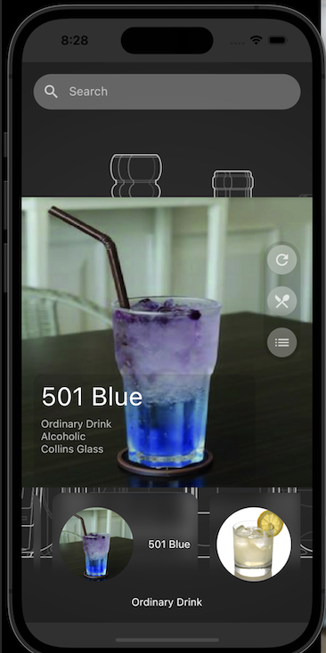

# Cocktail Cookbook Project

(cocktail_cookbook)

A Flutter project to complete a Take-Home Test from Fulltime Force.

## How to Install and Run this project
1. Install latest Flutter version.  At the time this project has been released, it was Flutter 3.3.10 • channel stable.  You can view the Flutter web site at https://flutter.dev.  And how to install, according to your operating system at https://docs.flutter.dev/get-started/install.
2. Download this repo as a zip, or use any other tool or app like "GitHub Desktop".  Or you can type in your Terminal or Command line the following:
```
git clone https://github.com/abnerh69/cocktail_cookbook_100.git
```
4. Enter in the folder created for this project, for example:
```
cd /Users/YOUR_USER_NAME/Documents/cocktail_cookbook_100
or
cd C:/Users/YOUR_USER_NAME/Desktoop/cocktail_cookbook_100
```
4. Get the required packages to compile the executable
```
flutter pub get
```
5. Run or execute the app with the following command:
```
flutter run
```
It will ask you to select on wich device you want to run or execuete the app.  Select one and wait until it appears on the device screen.


